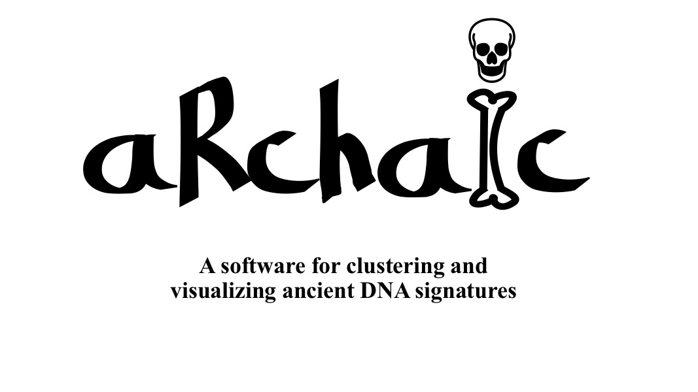
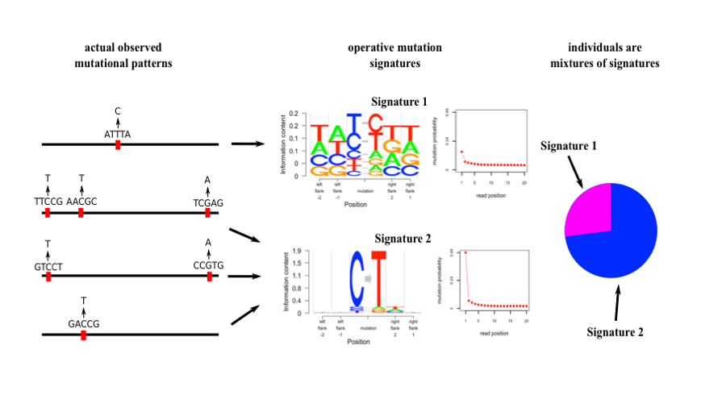

 Introduction 

**aRchaic** is a R/python software package developed by [Kushal Dey](https://kkdey.github.io/) and [Hussein Al Asadi](https://halasadi.wordpress.com/) in collaboration with [Matthew Stephens](http://stephenslab.uchicago.edu/) and [John Novembre](https://jnpopgen.org/).It is targeted towards exploratory analysis, clustering and summary visualization of patterns of DNA damage and other mutational profiles in large scale ancient DNA data. 

 Requirements 

 To install and run **aRchaic**, the user needs to install the following

<ul style="list-style-type:circle">
  <li><a href="https://git-scm.com/">  Git  </a></li>
  <li><a href="https://www.python.org/">  Python (versions 2 and 3)  </a></li>
  <li><a href="https://cran.r-project.org/">  R (>= 3.3.0)  </a></li>
  <li>  R libraries - <a href="https://github.com/pysam-developers/pysam/"> grid </a>, <a href="https://cran.r-project.org/web/packages/gridBase/index.html"> gridBase </a>, <a href="http://ggplot2.org/"> ggplot2 </a>, <a href="https://github.com/kkdey/maptpx"> maptpx </a>, <a href="https://github.com/kkdey/CountClust"> CountClust </a>, <a href="https://github.com/kkdey/Logolas"> Logolas </a>, <a href="https://github.com/kkdey/classtpx"> classtpx </a> </li> 
</ul> 

 Overview 

 **aRchaic** performs exploratory analysis of ancient DNA as well as modern DNA from one or more sources based on <i> mutation profiles </i>. 

  <i> What do we mean by mutation profiles </i>  

 For each mutation, we define a <i> mutational profile </i>  

-  the type of mutation it is - C &#8594; T , C &#8594; A, C &#8594; G, T &#8594; A, T &#8594; C, T &#8594; G. 

-  the flanking bases to the left and right of the mutation (user can choose the number of flanking bases). 

-  position of the mutation relative to the two ends of the reads.

-  the strand information ("+" or "-" strand). 

-  the strand break nucleotide composition, whether the immediate bases to the left of the 5' end of the strand  and to the right of the 3' end of the strand are A, C, G or T. 

 A tyical mutational pattern obtained from a BAM file would look like  

 AA (C &#8594; T) GA, 3, 50, +, A, G, 2 

 This means that in the BAM, 2 occurrences have been found of a mutation that is C &#8594; T, flanked by two A's on the left and a G and A on the right on the "+" strand, that are 3 positions and 50 positions away from the 5' and 3' ends of the reads carrying this mutation and immediate bases to the left and right of the reads are A and G. 

 We go through each BAM file in a directory hosting all BAM files of interest and record counts of the above type of mutational patterns from the BAM file (mostly they would be very small in number). 

  <i> Clustering based on mutational patterns </i>  

 Once the <i> mutational profiles </i>  have been recorded for each BAM file (corresponding to each sample from the population of interst), **aRchaic** can be used to cluster the samples based on their  <i> mutational profiles </i> 

  For the clustering model, we draw analogy of our model with <a href="https://www.genetics.ucla.edu/software/admixture/">ADMIXTURE </a> and <a href="http://pritchardlab.stanford.edu/structure.html">STRUCTURE </a>. In ADMIXTURE, for K=2, each person (say an African-American) is represented as a mixture of two ancestries - expectedly the African ancestry and the American ancestry - where ancestries are defined by a probability vector on allele frequencies.  

  In our model, for K=2, each sample can be represented as a mixture of two  <it> mutational signatures </it>, where a <it> mutational signature </it> is a probability vectors on mutational patterns. The mixture proportions are called <it> signature admixture probabilities </it>.  

  For instance, since one expects to see a lot of C &#8594; T changes in ancient DNA, sor aDNA samples, a mutational signature can be expected to have very high probability on mutational patterns that consist of the C &#8594; T mutation.  

 Another way to see this is if we have a contaminated sample of ancient DNA, that reads from the sample can be assumed to come either from a modern mutational <it> signature </it> or an ancient mutational <it> signature </it> with certain probability. 

 We present below a graphical illustration of our approach. 

  <i> Visualization of the clustering </i>  

 to be updated 

 Contact 

Having trouble with **aRchaic**? 

 Leave an issue in our [Github page](https://github.com/kkdey/aRchaic/issues) 
or contact us : <a href="mailto:kshldey@gmail.com">kkdey@uchicago.edu</a>, <a href="mailto:halasadi@gmail.com">halasadi@uchicago.edu</a>  

