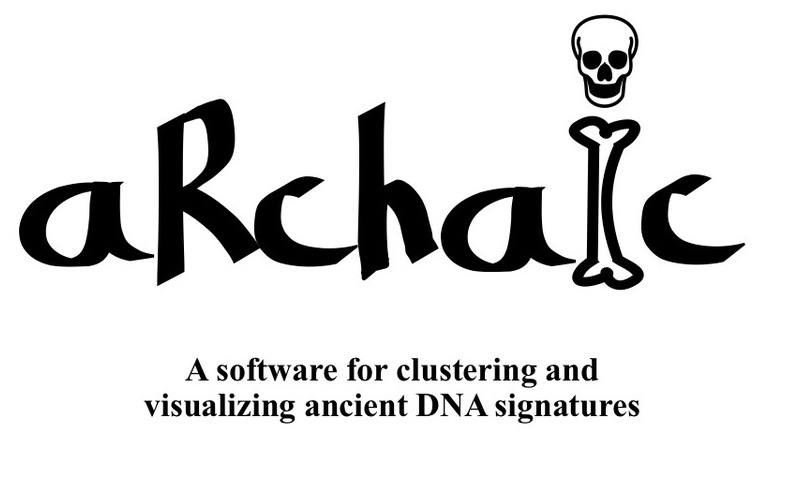

 Introduction 

**aRchaic** is a R/python software package developed by [Kushal Dey](https://kkdey.github.io/) and [Hussein Al Asadi](https://halasadi.wordpress.com/) in collaboration with [Matthew Stephens](http://stephenslab.uchicago.edu/) and [John Novembre](https://jnpopgen.org/).It is targeted towards exploratory analysis, clustering and summary visualization of patterns of DNA damage and other mutational profiles in large scale ancient DNA data. 

 Overview 

 Contact 

Having trouble with aRchaic? 

Leave an issue in our [Github page](https://github.com/kkdey/aRchaic/issues) 
or contact us : <a href="mailto:kshldey@gmail.com">kkdey@uchicago.edu</a>, <a href="mailto:halasadi@gmail.com">halasadi@uchicago.edu</a>

